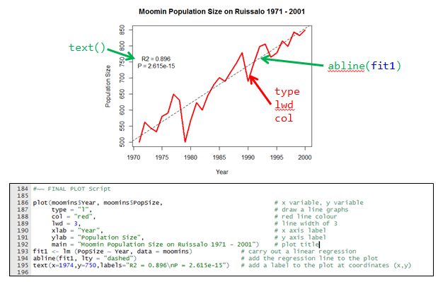

```{r setup, include=FALSE}
knitr::opts_chunk$set(echo = TRUE)
#knitr::opts_knit$set(global.device = TRUE)
```

```{r load packages,include=FALSE}
library(tidyverse)
```

## Acknowledgements
What follows is more or less a copy of the excellent code and notes by Susan Johnston (Susan.Johnston@ed.ac.uk)  

Thank you Susan!

## Introduction
One of the most powerful functions of R is it's ability to produce a wide range of graphics to quickly and easily visualise data. Plots can be replicated, modified and even publishable with just a handful of commands.

Making the leap from chiefly graphical programmes, such as Excel and Sigmaplot or Minitab may seem tricky. However, with a basic knowledge of R, just investing a few hours could completely revolutionise your data visualisation and workflow. Trust me - it's worth it.

This file shows how to build different plot types using the basic (i.e. pre-installed) graphics in R, including:

![][titleFigure]

##  What types of data can we build graphs from?

#### vectors
```{r}
height<-c(145,167,176,123,150)
weight<-c(51,63,64,40,55)
```

```{r}
plot(height,weight)
```

### data frames

```{r}
tarsus<-read.csv("tarsus.csv")
head(tarsus)
```

```{r}
str(tarsus)
```

##### To call a variable in the dataframe, use the $ notation.
```{r}
tarsus$TarsusLength
```

```{r}
tarsus$Weight
```

```{r}
plot(tarsus$TarsusLength,tarsus$Weight)
```

### tables

```{r}
tarsus_tab<-table(tarsus$TarsusLength)
tarsus_tab
```

```{r}
plot(tarsus_tab)
```

```{r}
barplot(tarsus_tab)
```

## Basic Histogram

What customisations are we going to learn in this section?

![][histogram]


For this part, we will use data on birthweight measured in male and female unicorns.  
Lets read the data into R:

```{r}
unicorns<-read.csv("unicorns.csv")
head(unicorns)
```

```{r}
str(unicorns)
```

We can create a basic histograms of unicorn birthweight and longevity using hist():

```{r}
hist(unicorns$birthweight)            # normal distribution
```

```{r}
hist(unicorns$longevity)              # poisson distribution
```

And we can specify the number of cells for the histogram using: breaks = N:

```{r}
hist(unicorns$birthweight, breaks = 40)
```

```{r}
hist(unicorns$birthweight, breaks = c(0,1,2,3,4,5,6,7))
```

```{r}
hist(unicorns$birthweight, breaks = c(0,1,2,3,4,7))
```

Relabel the x-axis using: xlab = "Text"

```{r}
hist(unicorns$birthweight, breaks = 40, xlab = "Birth Weight")
```

Relabel the main title using: main = "Text"     

```{r}
hist(unicorns$birthweight,
     breaks = 40,
     xlab = "Birth Weight",
     main = "Histogram of Unicorn Birth Weight")
```

NB: In our code, the lines were starting to get quite long so we have spread it over several lines. When there is a comma, R knows that there is more information on the next line!

The y-axis stops short of the highest value in the histogram. Lets specify new limits using: ylim = c(minimum, maximum)

```{r}
hist(unicorns$birthweight,
     breaks = 40,
     xlab = "Birth Weight", 
     main = "Histogram of Unicorn Birth Weight",
     ylim = c(0,80))
```


#### So, in summary the code for our final plot is:

```{r}
hist(unicorns$birthweight,                            # x value
     breaks = 40,                                     # number of cells
     xlab = "Birth Weight",                           # x-axis label
     main = "Histogram of Unicorn Birth Weight",      # plot title
     ylim = c(0,80))                                  # limits of the y axis (min,max)
```

### Which customisations did we learn in this section?

*  hist
*  breaks
*  xlab & ylab
*  main
*  ylim & xlim


## 2. Basic Line Graph with Regression


Moomins are a common pest species in Finland. We have data on their population on the island of Ruissalo from 1971 to 2000.  

Which customisations will we learn here?  



```{r}
moomins<-read.csv("Moomin Density.csv")
head(moomins)
```

#~~ Create a plot using the default options in plot.

```{r}
plot(moomins$Year, moomins$PopSize)
```

There are several types of plot within the plot function. Use "type":   

```{r}
plot(moomins$Year, moomins$PopSize, type = "l")     # Try "o" "p" "l" "b"
```

We can also change the line type using "lty"

```{r}
plot(moomins$Year, moomins$PopSize, type = "l", lty = "dashed")
```

```{r}
plot(moomins$Year, moomins$PopSize, type = "l", lty = "dotted")
```

The solid line looks best, so lets stick with it.

```{r}
plot(moomins$Year, moomins$PopSize, type = "l")
```

Let's start to add colour using "col".

```{r}
plot(moomins$Year, moomins$PopSize, type = "l", col = "red")    # R Colour Chart
```

NB. numbers can also be used as colours!

```{r}
plot(moomins$Year, moomins$PopSize, type = "l", col = 3)
```

Let's make the line a little thicker using "lwd" (line width)

```{r}
plot(moomins$Year, moomins$PopSize, type = "l", col = "red", lwd = 3)
```

Finally, lets sort out the axis titles plot title:

Also:  
Is the Moomin population increasing in size?  
We can add a basic linear regression to the plot and then add the regression line to the plot using "abline"  
NB. we can also use lty, lwd, col here 

Finally, we can add some text to the plot giving the R2 value and the P value using "text"   
We need to specify the x and y coordinates for the text

```{r}
plot(moomins$Year, moomins$PopSize, 
     type = "l", 
     col = "red", 
     lwd = 3,
     xlab = "Year",
     ylab = "Population Size",
     main = "Moomin Population Size on Ruissalo 1971 - 2001")

fit1 <- lm (PopSize ~ Year, data = moomins) 
summary(fit1)
abline(fit1, lty = "dashed")    #abline(a=intercept,b=slope)
text(x=1974,y=750,labels="R2 = 0.896\nP = 2.615e-15")
```

#### The FINAL PLOT Script:

```{r}
plot(moomins$Year, moomins$PopSize,                              # x variable, y variable
     type = "l",                                                 # draw a line graphs
     col = "red",                                                # red line colour
     lwd = 3,                                                    # line width of 3
     xlab = "Year",                                              # x axis label
     ylab = "Population Size",                                   # y axis label
     main = "Moomin Population Size on Ruissalo 1971 - 2001")    # plot title

fit1 <- lm (PopSize ~ Year, data = moomins)             # carry out a linear regression
abline(fit1, lty = "dashed")                            # add the regression line to the plot
text(x=1974,y=750,labels="R2 = 0.896\nP = 2.615e-15")   # add a label to the plot at coordinates (x,y)
```


#### Which customisations did we learn in this section?

* plot
* type
* lty
* lwd
* col
* abline
* text

##    3. Scatterplot with Legend

What will we learn here?  


R comes with many datasets preinstalled.
Let's load a dataset of flower characteristics in 3 species of Iris.

```{r}
data(iris)
head(iris)
```

There is a lot of data here! Let's explore using the 'pairs' function

```{r}
pairs(iris)
```

This doesn't tell us much about the species differences. We can tell R to plot using a different colour for the three species of iris:

```{r}
pairs(iris, col = iris$Species)
```

Sepal.Length and Petal.Length look interesting! Let's start by looking at that.  
Again, we will specify colour as the Species.

```{r}
plot(iris$Sepal.Length, iris$Petal.Length, col = iris$Species)
```

These points are difficult to see! Let's pick some different ones using "pch"

```{r}
plot(iris$Sepal.Length, iris$Petal.Length, col = iris$Species, pch = 15)
plot(iris$Sepal.Length, iris$Petal.Length, col = iris$Species, pch = "A")
```

pch 21:25 also specify an edge colour (col) and a background colour (bg)

```{r}
plot(iris$Sepal.Length, iris$Petal.Length, col = iris$Species, pch = 21, bg = "blue")
```

let's settle on solid circles (pch = 16)

```{r}
plot(iris$Sepal.Length, iris$Petal.Length, col = iris$Species, pch = 16)
```

we can change the size of the points with "cex"

```{r}
plot(iris$Sepal.Length, iris$Petal.Length, col = iris$Species, pch = 16, cex = 2)
```

It's difficult to tell these points apart, so perhaps we should make a legend.   
This is one of the major drawbacks with R.  
iris$Species is a factor, and R will automatically order factors in alphabetical order.

```{r}
levels(iris$Species)
```

Therefore, setosa, versicolor and virginica will correspond to 1, 2 and 3 on the plot default colours. Keep this in mind for the final plot, where we include a legend!

#### FINAL PLOT

```{r}
plot(iris$Sepal.Length, iris$Petal.Length,        # x variable, y variable
     col = iris$Species,                          # colour by species
     pch = 16,                                    # type of point to use
     cex = 2,                                     # size of point to use
     xlab = "Sepal Length",                       # x axis label
     ylab = "Petal Length",                       # y axis label
     main = "Flower Characteristics in Iris")     # plot title

legend (x = 4.5, y = 7, legend = levels(iris$Species), col = c(1:3), pch = 16)
# legend with titles of iris$Species and colours 1 to 3, point type pch at coords (x,y)
```

#~~~ Which customisations did we learn in this section?

* pch
* bg
* cex
* legend


### SIDE NOTE 1: specifying colours:
It is also possible to specify colours in your data frame.

```{r}
iris$Colour <- ""
iris$Colour[iris$Species=="setosa"] <- "magenta"
iris$Colour[iris$Species=="versicolor"] <- "cyan"
iris$Colour[iris$Species=="virginica"] <- "yellow"

plot(iris$Sepal.Length, iris$Petal.Length, col = iris$Colour, pch = 16, cex = 2)
legend(x = 4.5, y = 7, legend = c("setosa","versicolor","virginica"),col=c("magenta","cyan","yellow"), pch=16)
```

### SIDE NOTE 2:
It would also be possible to specify lines in the legend by using "lty" instead of "pch"

```{r}
plot(iris$Sepal.Length, iris$Petal.Length, col = iris$Species, pch = 16, cex = 2)
legend(4.5,7,legend=c("setosa","versicolor","virginica"),col=c(1:3),lty="solid")
```

##    4. Boxplots with reordered and formatted axes

We will continue to use the Iris dataset for this section

```{r}
head(iris)
```

#~~ lets examine the distribution of Sepal Length for each species

```{r}
boxplot(iris$Sepal.Length ~ iris$Species)
```

If you wish to compare the medians of the boxplot, you can use the function "notch".  
If the notches of two plots do not overlap, this is 'strong evidence' that the two medians differ (see ?boxplot)

```{r}
boxplot(iris$Sepal.Length ~ iris$Species, notch = T)
```

You may have noticed that the y-axis labels are always orientated to be perpendicular to the axis. We can rotate all axis labels using "las". Play around with different values.

```{r}
boxplot(iris$Sepal.Length ~ iris$Species, notch = T, las = 1)
```

Let's add in all the axis and plot labels:

```{r}
boxplot(iris$Sepal.Length ~ iris$Species, notch = T, las = 1,
        xlab = "Species", ylab = "Sepal Length", main = "Sepal Length by Species in Iris") 
```

Like we can change the size of the points in the scatterplot, we can change the size of the axis labels and titles. Let's start with "cex.lab", which controls the axis titles:

```{r}
boxplot(iris$Sepal.Length ~ iris$Species, notch = T, las = 1,
        xlab = "Species", ylab = "Sepal Length", main = "Sepal Length by Species in Iris",
        cex.lab=1.5)
```

Now we can add in "cex.axis" (changing the tickmark size) and "cex.main" (changing the  plot title size)

```{r}
boxplot(iris$Sepal.Length ~ iris$Species, notch = T, las = 1,
        xlab = "Species", ylab = "Sepal Length", main = "Sepal Length by Species in Iris",
        cex.lab = 1.5,
        cex.axis = 1.5,
        cex.main = 2)
```

As we discussed earlier, R automatically puts factors in alphabetical order. But perhaps we would prefer to list the iris species as virginica, versicolor and setosa.

First lets look at the levels of iris:

```{r}
data(iris)
levels(iris$Species)
```

we reorder them with the following command:

```{r}
iris$Species<-factor(iris$Species, levels = c("virginica","versicolor","setosa"))
```

#### FINAL PLOT

```{r}
boxplot(iris$Sepal.Length ~ iris$Species,              # x variable, y variable
        notch = T,                                     # Draw notch
        las = 1,                                       # Orientate the axis tick labels
        xlab = "Species",                              # X-axis label
        ylab = "Sepal Length",                         # Y-axis label
        main = "Sepal Length by Species in Iris",      # Plot title
        cex.lab = 1.5,                                 # Size of axis labels
        cex.axis = 1.5,                                # Size of the tick mark labels
        cex.main = 2)                                  # Size of the plot title
```

#### Which customisations did we learn in this section?

* boxplot
* notch
* las
* cex.lab
* cex.axis
* cex.main


##   5. Barplot  with error bars

Let's create a new data frame with information on three populations of dragon in the UK:  
Working with summaries, rather than the whole data, is a bit easier with this function.

```{r}
dragons <- data.frame(TalonLength = c(20.9, 58.3, 35.5),
                      SE = c(4.5, 6.3, 5.5),
                      Population = c("England", "Scotland", "Wales")
                      )
```

Have a look at the data:

```{r}
dragons
```

Let's make our barplot.

```{r}
barplot(dragons$TalonLength)
```

It would be better to add Titles to the x-axis:

```{r}
barplot(dragons$TalonLength, names = dragons$Population)
```

would a box look better around this plot?

```{r}
barplot(dragons$TalonLength, names = dragons$Population)
box()
```

not really. Let's start again:

```{r}
barplot(dragons$TalonLength, names = dragons$Population)
```

Let's reorder the columns by how beautiful the dragon habitat is (from best to worst).
Suppose this order is 'Scotland, Wales, England'.

```{r}
levels(dragons$Population)
```

```{r}
dragons$Population <- factor(dragons$Population, levels=c("Scotland","Wales","England"))
levels(dragons$Population)
```

```{r}
barplot(dragons$TalonLength, names = dragons$Population)
```

No.... it's not working. I give up for now.  
What about error bars?   
This is as far as I got before I gave up:

```{r}
#install.packages("gplots") ## do this in the console if necessary
library(gplots)
barplot(dragons$TalonLength, names = dragons$Population, 
        ylim=c(0,70),xlim=c(0,4),yaxs='i', xaxs='i',
        main="Dragon Talon Length in the UK",
        ylab="Mean Talon Length",
        xlab="Country")
par(new=T)
plotCI (dragons$TalonLength, 
        uiw = dragons$SE, liw = dragons$SE,
        gap=0,sfrac=0.01,pch="",
        ylim=c(0,70),
        xlim=c(0.4,3.7),
        yaxs='i', xaxs='i',axes=F,ylab="",xlab="")
box()
```

Lets deal with this in ggplot2!

#### FINAL PLOT

Do it in ggplot2!

##   Final words in base graphics

##   6. More than one plot in a window 

```{r}
par(mfrow=c(1,2))      # number of rows, number of columns

plot(iris$Sepal.Length, iris$Petal.Length,        # x variable, y variable
     col = iris$Species,                          # colour by species
     main = "Sepal vs Petal Length in Iris")      # plot title

plot(iris$Sepal.Length, iris$Sepal.Width,         # x variable, y variable
     col = iris$Species,                          # colour by species
     main = "Sepal Length vs Width in Iris")      # plot title

par(mfrow=c(1,1))     # sets the plot window back to normal
```

OR

```{r}
dev.off()      # But this will clear your plot history.
```


##  7. Saving a Plot

These code code chunks show how to save a plot into your working directory as either a .png file or a pdf file

### png

```{r}
png("Sepal vs Petal Length in Iris.png", width = 500, height = 500, res = 72)

plot(iris$Sepal.Length, iris$Petal.Length,
     col = iris$Species,
     main = "Sepal vs Petal Length in Iris")

dev.off()
```


### pdf

```{r}
pdf("Sepal vs Petal Length in Iris.pdf")

plot(iris$Sepal.Length, iris$Petal.Length,
     col = iris$Species,
     main = "Sepal vs Petal Length in Iris")

dev.off()
```


## 8. par()

```{r}
plot(moomins$Year, moomins$PopSize, type="l")
boxplot(iris$Sepal.Length ~ iris$Species)
```

```{r}
par(col=2,pch=16,las=1,lty="dotted") # affects all subsequent plots

plot(moomins$Year, moomins$PopSize, type="l")
boxplot(iris$Sepal.Length ~ iris$Species)
dev.off() # resets par() to default values
```

Now that par() has been reset to defaut values, subsequent plots have the default appearance

```{r}
plot(moomins$Year, moomins$PopSize, type="l")
boxplot(iris$Sepal.Length ~ iris$Species)
par(mfrow=c(1,1))
```


##   9. Examples for the plot functions in R Base Graphics

```{r,eval=FALSE}
# try these in your console window
example(plot)
example(barplot)
example(boxplot)
example(coplot)
example(hist)
example(fourfoldplot)
example(stars)
example(image)
example(contour)
example(filled.contour)
example(persp) 
```


##   10. Trellis plots using library(lattice)


scatterplots for each combination of two factors 

```{r}
library(lattice)

xyplot(iris$Petal.Length ~ iris$Sepal.Length | iris$Species, layout = c(3,1))

histogram( ~ unicorns$birthweight | unicorns$sex, layout = c(1,2))
```


[titleFigure]: figures/titleFigure.png "Title"
[histogram]: figures/histogram.png "Title"
[moomins]: figures/moomins.png "Title"
[linear fit]: figures/lfit.png "Title"
[scattePlotrWithLgnd]: figures/scatterplot.png "Title"

